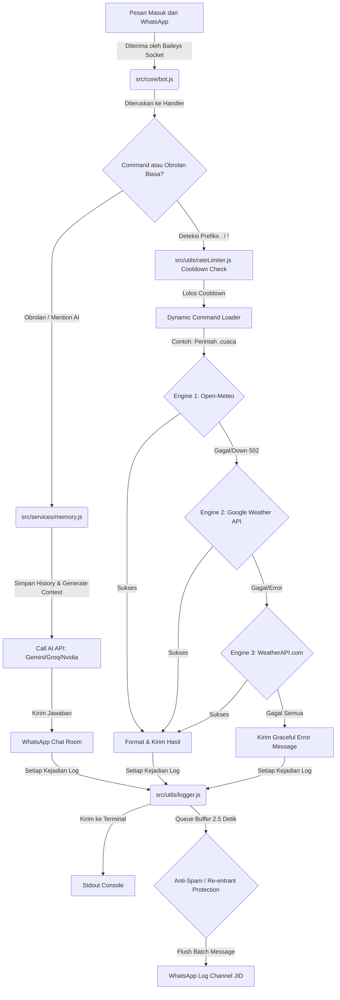

# ⚙️ WABOT 2.0 - Core System Architecture & Workflow

Selamat datang di dokumentasi arsitektur sistem **WABOT 2.0 (RonnBot)**. Dokumen ini dirancang untuk memberikan gambaran menyeluruh mengenai struktur berkas, ketergantungan library (dependencies), alur kerja (workflow), serta mekanisme pipeline deployment bot.

---

## 📂 1. Struktur Direktori & File Core

Berikut adalah struktur folder utama beserta peran masing-masing komponen di dalam sistem:

```text
WABOT2.0/
├── changelogs/             # Folder penyimpanan rilis lokal (.md)
│   ├── v2.0.0.md           # Log versi 2.0.0
│   └── v2.1.0.md           # Log versi 2.1.0 (cuaca & stabibilitas)
├── storage/                # Penyimpanan data lokal persisten
│   ├── database/
│   │   └── main.db         # Database utama SQLite (caching sound, subs, dll)
│   ├── logs/
│   │   └── app.log         # Berkas log terstruktur di level production
│   └── sessions/           # Kredensial auth WhatsApp multi-device (Baileys)
├── src/                    # Source code utama aplikasi
│   ├── core/
│   │   └── bot.js          # Inisialisasi socket Baileys, auth, & heartbeat
│   ├── commands/           # Modul perintah dikelompokkan secara logis
│   │   ├── entertainments/ # Perintah hiburan (sound.js, meme.js, dll)
│   │   ├── general/        # Perintah umum (changelogs.js, menu.js, dll)
│   │   ├── group/          # Fitur moderasi grup (pin.js, dll)
│   │   ├── owner/          # Perintah khusus owner (bc.js, dll)
│   │   └── utility/        # Fitur utilitas (cuaca.js, dll)
│   ├── services/
│   │   ├── interactive.js  # Mengelola percakapan interaktif (tanya-jawab)
│   │   └── memory.js       # Mengelola riwayat percakapan untuk AI Context
│   └── utils/
│       ├── group.js        # Helper moderasi, admin check, dll
│       ├── logger.js       # Global logger ke terminal & WhatsApp Log Channel
│       └── rateLimiter.js  # Cooldown command per user
├── .env                    # Konfigurasi sensitif (API Keys, JID Log, dll)
├── deploy.js               # Automasi Git commit & push, SFTP sync, & restart bot
└── start.js                # Daemon runner untuk me-load dotenv & menjalankan bot
```

---

## 📊 2. Alur Kerja Sistem (System Workflow Diagram)

Berikut adalah diagram visual yang menunjukkan bagaimana **WABOT 2.0** menerima pesan, memproses perintah, mengelola database lokal, melakukan fallback API cuaca, hingga memancarkan log otomatis ke channel log WhatsApp.



---

## 🛠️ 3. Library Utama & Peran Dependencies

| Nama Library | Peran Utama dalam WABOT 2.0 |
| :--- | :--- |
| **`@whiskeysockets/baileys`** | Menghubungkan bot dengan server WhatsApp secara langsung via protocol WebSockets, mendukung multi-device, media download, pinning, dan custom message formats. |
| **`better-sqlite3`** | Engine database SQLite super cepat untuk Node.js. Dipakai untuk caching pencarian sound MyInstants, data langganan cuaca harian, dan history chat AI. |
| **`pino` & `pino-pretty`** | Menangani log aplikasi secara terstruktur, cepat, dan rapi di terminal sebelum difilter untuk dikirim ke WhatsApp Log Channel. |
| **`axios` & `cheerio`** | Mengunduh file, melakukan request API fallback, dan melakukan web scraping data HTML (seperti scraping MP3 MyInstants). |
| **`dotenv`** | Memuat variabel lingkungan dari file `.env` ke `process.env` untuk melindungi data kredensial / API Keys. |

---

## 🚀 4. Alur Kerja Deployment (Pipeline Workflow)

Ketika kamu menjalankan perintah `npm run push` di terminal local:

1. **Git Automation (`deploy.js`)**:
   - Memeriksa status repositori git lokal.
   - Melakukan delta commit otomatis dengan pesan waktu terkini (misal: `"deploy: sync auto 2026-06-04 13:27:09"`).
   - Melakukan `git push` untuk mencadangkan kode terbaru ke repositori GitHub jarak jauh.
2. **SFTP Sync**:
   - Menghubungkan koneksi aman SFTP ke panel Pterodactyl.
   - Membandingkan berkas dan hanya mengunggah file yang berubah saja (*delta sync*) demi efisiensi bandwidth.
3. **Bot Restart**:
   - Mengirim sinyal perintah melalui API Pterodactyl untuk me-restart server bot secara instan.
   - Bot memicu fungsi `shutdown` yang langsung melakukan `flushLogsImmediately()` untuk mengirim notifikasi restart ke log channel WhatsApp sebelum proses dimatikan dan dihidupkan ulang oleh start script.
