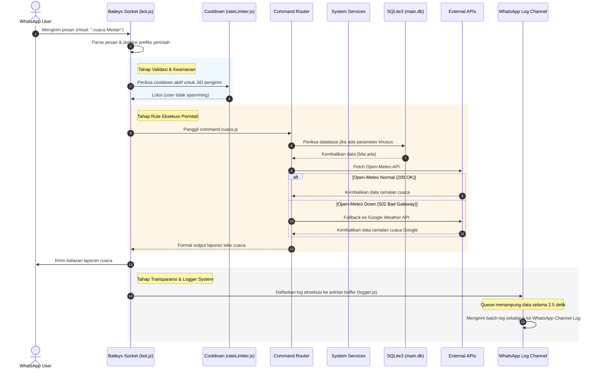
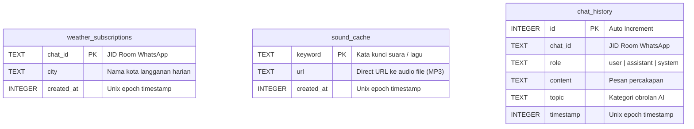
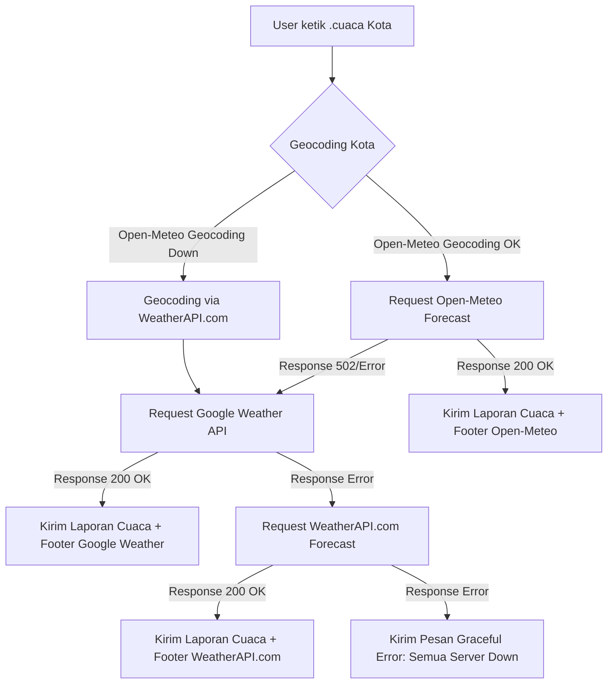

# ⚙️ WABOT 2.0 - Core System Architecture & Workflow

Selamat datang di spesifikasi arsitektur teknis **WABOT 2.0 (RonnBot)**. Dokumen ini dibuat untuk memetakan secara detail struktur data, ketergantungan sistem, alur proses (*workflows*), skema database, serta alur otomatisasi rilis lokal.

---

## 🗺️ 1. Mindmap Struktur Sistem & Folder (Mermaid Map)

Di bawah ini adalah representasi visual diagram pohon hirarki folder dari codebase WABOT 2.0:

```mermaid
graph TD
    %% Styling Nodes
    classDef root fill:#29b6f6,stroke:#01579b,stroke-width:3px,color:#fff,font-weight:bold;
    classDef core fill:#e1f5fe,stroke:#03a9f4,stroke-width:2px,color:#01579b;
    classDef cmd fill:#f3e5f5,stroke:#ab47bc,stroke-width:2px,color:#4a148c;
    classDef service fill:#e8f5e9,stroke:#66bb6a,stroke-width:2px,color:#1b5e20;
    classDef util fill:#fff3e0,stroke:#ffb74d,stroke-width:2px,color:#e65100;
    classDef storage fill:#efebe9,stroke:#a1887f,stroke-width:2px,color:#3e2723;

    Root((WABOT 2.0)):::root --> Core[Core Engine]:::core
    Root --> Cmds[Command Modules]:::cmd
    Root --> Serv[System Services]:::service
    Root --> Utils[Utility Helpers]:::util
    Root --> Stor[Storage & Database]:::storage

    %% Core Sub-Tree
    Core --> start_js[start.js<br/>dotenv loader & daemon]
    Core --> bot_js[src/core/bot.js<br/>Baileys connection & socket]

    %% Commands Sub-Tree
    Cmds --> cmd_ent[entertainments/<br/>sound.js, meme.js]
    Cmds --> cmd_gen[general/<br/>changelogs.js, aboutbots.js]
    Cmds --> cmd_grp[group/<br/>pin.js]
    Cmds --> cmd_own[owner/<br/>bc.js]
    Cmds --> cmd_utl[utility/<br/>cuaca.js]

    %% Services Sub-Tree
    Serv --> s_inter[interactive.js<br/>Tanya-jawab interaktif]
    Serv --> s_mem[memory.js<br/>Context isolation & AI history]

    %% Utils Sub-Tree
    Utils --> u_grp[group.js<br/>Admin-role validators]
    Utils --> u_log[logger.js<br/>Batch channel log formatter]
    Utils --> u_lim[rateLimiter.js<br/>User command cooldown]

    %% Storage Sub-Tree
    Stor --> db_main[storage/database/main.db<br/>Persisten Better-SQLite3]
    Stor --> db_sess[storage/sessions/<br/>Kredensial auth WhatsApp]
```

---

## 🔄 2. Alur Eksekusi Pesan & Perintah (Execution Workflow)

Diagram alur di bawah menggambarkan perjalanan pesan masuk dari server WhatsApp hingga diproses oleh bot, baik sebagai perintah langsung (command), AI conversation, maupun logging system.

---

## 🗄️ 3. Skema Relasi Database Lokal (Better-SQLite3)

Aplikasi menggunakan **SQLite3** via library performa tinggi `better-sqlite3` untuk menyimpan state dinamis tanpa overhead database server eksternal. Berikut adalah skema tabel persisten yang digunakan:

---

## ☀️ 4. Desain Struktur Fallback Cuaca 3-Tingkat (Triple Engine)

Ketika server Open-Meteo mengalami gangguan (outage), bot tidak akan mogok atau crash. Sistem akan mengalihkan request secara transparan melalui alur bertingkat berikut:

---

## 🛠️ 5. Teknologi Core & Library Dependencies

| Library / Dependencies | Deskripsi Teknis |
| :--- | :--- |
| **`@whiskeysockets/baileys`** | Implementasi lightweight WhatsApp Web API. Menangani koneksi soket, handshake, pemeliharaan sesi terenkripsi, enkripsi pesan, serta event listener obrolan. |
| **`better-sqlite3`** | Wrapper database SQLite tercepat di Node.js yang mengeksekusi kueri SQL secara sinkronus untuk latensi memori mendekati nol. |
| **`pino` & `pino-pretty`** | Logger asinkronus dengan overhead CPU sangat rendah. Membantu pelacakan stack trace error runtime bot di terminal secara real-time. |
| **`axios` & `cheerio`** | Axios digunakan untuk koneksi HTTP client handal, sedangkan Cheerio digunakan untuk mem-parsing DOM HTML pada proses scraping asset audio MyInstants. |
| **`dotenv`** | Membaca berkas `.env` dan menyuntikkan konfigurasinya ke dalam variabel lingkungan lokal (`process.env`). |

---

## 🚀 6. Alur Automasi Pipeline Rilis (`deploy.js`)

Ketika perintah **`npm run push`** dijalankan di lokal developer:

1. **Git Delta Commit**: Skrip memeriksa status git repositori lokal. Jika ada modifikasi berkas, skrip secara otomatis melakukan commit lokal dengan penanda waktu dinamis, lalu melakukan `git push` ke repositori pusat GitHub.
2. **SFTP Delta Sync**: Skrip membuka koneksi SFTP aman ke server panel Pterodactyl. Menggunakan algoritma pembanding ukuran file dan tanggal modifikasi (*delta sync*) untuk hanya mengunggah file yang berubah secara real-time.
3. **Pterodactyl Remote Restart**: Pemicu API dikirim ke panel untuk me-restart bot. Bot mengeksekusi fungsi `shutdown()`, memaksa antrian log WhatsApp dikirim seketika (`flushLogsImmediately()`), menghentikan proses koneksi Baileys secara aman, lalu daemon server menghidupkan kembali bot dengan kode terbaru.
