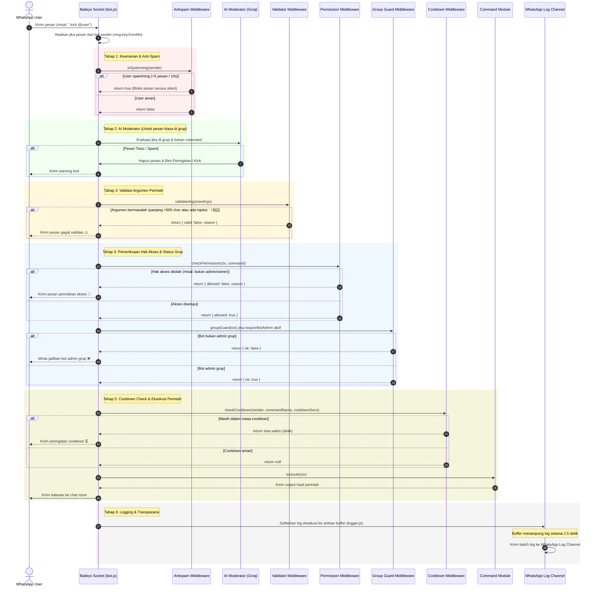
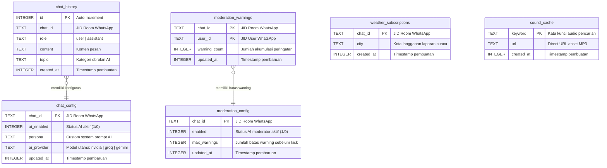
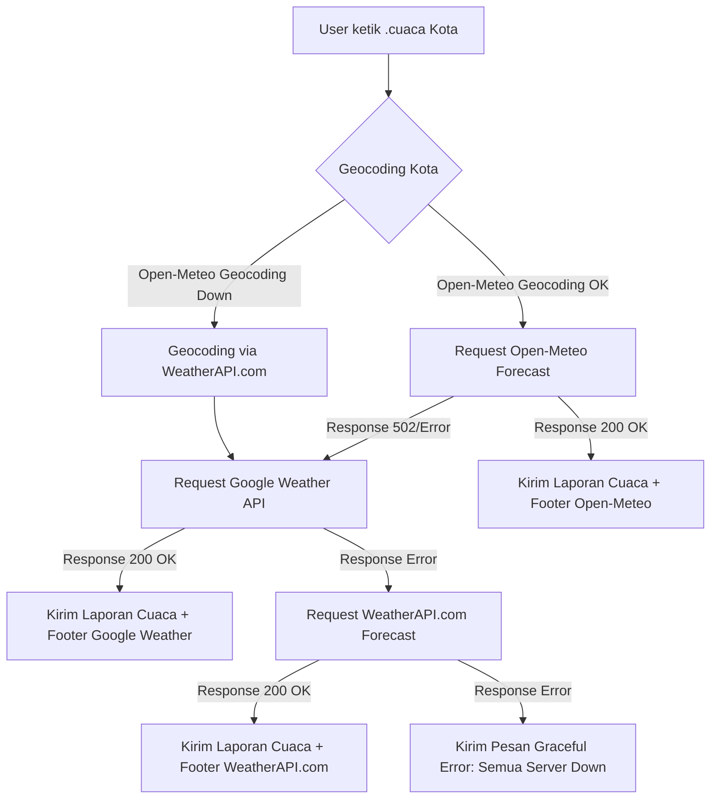

# ⚙️ WABOT 2.0 - Core System Architecture, Workflows & Dependencies

Selamat datang di spesifikasi arsitektur teknis **WABOT 2.0 (RonnBot)**. Dokumen ini dibuat untuk memetakan secara detail struktur direktori, alur pemrosesan pesan (message pipeline) dengan middleware lengkap, rancangan database relasional lokal (SQLite), daftar dependensi paket, serta mekanisme automasi rilis.

---

## 🗺️ 1. Mindmap Struktur Sistem & Folder

Representasi visual diagram pohon hirarki folder dari codebase WABOT 2.0:

```mermaid
graph TD
    %% Styling Nodes
    classDef root fill:#29b6f6,stroke:#01579b,stroke-width:3px,color:#fff,font-weight:bold;
    classDef core fill:#e1f5fe,stroke:#03a9f4,stroke-width:2px,color:#01579b;
    classDef cmd fill:#f3e5f5,stroke:#ab47bc,stroke-width:2px,color:#4a148c;
    classDef service fill:#e8f5e9,stroke:#66bb6a,stroke-width:2px,color:#1b5e20;
    classDef mid fill:#ffebee,stroke:#ef5350,stroke-width:2px,color:#b71c1c;
    classDef util fill:#fff3e0,stroke:#ffb74d,stroke-width:2px,color:#e65100;
    classDef storage fill:#efebe9,stroke:#a1887f,stroke-width:2px,color:#3e2723;

    Root((WABOT 2.0)):::root --> Core[Core Engine]:::core
    Root --> Cmds[Command Modules]:::cmd
    Root --> Serv[System Services]:::service
    Root --> Mids[Middlewares]:::mid
    Root --> Utils[Utility Helpers]:::util
    Root --> Stor[Storage & Database]:::storage

    %% Core Sub-Tree
    Core --> start_js[start.js<br/>dotenv loader & daemon]
    Core --> bot_js[src/core/bot.js<br/>Baileys connection & socket]
    Core --> loader_js[src/core/loader.js<br/>Dynamic ESM command loader]

    %% Commands Sub-Tree
    Cmds --> cmd_ai[ai/<br/>q.js, resetai.js]
    Cmds --> cmd_ent[entertainments/<br/>sound.js, meme.js, dare.js]
    Cmds --> cmd_gen[general/<br/>changelogs.js, aboutbots.js, remindme.js]
    Cmds --> cmd_grp[group/<br/>pin.js, kick.js, aimod.js]
    Cmds --> cmd_own[owner/<br/>bc.js, eval.js, src.js]
    Cmds --> cmd_utl[utility/<br/>cuaca.js, ocr.js, qr.js]

    %% Services Sub-Tree
    Serv --> s_ai[ai.js<br/>Fallback AI NVIDIA -> Groq -> Gemini]
    Serv --> s_inter[interactive.js<br/>Interactive session handler]
    Serv --> s_mem[memory.js<br/>Context isolation & SQLite memory]
    Serv --> s_mod[moderator.js<br/>AI Toxic Detector using Groq]

    %% Middleware Sub-Tree
    Mids --> m_spam[antispam.js<br/>Rate-limiter per JID]
    Mids --> m_cool[cooldown.js<br/>Per-user-command cooldown]
    Mids --> m_perm[permission.js<br/>Owner, admin & user privileges]
    Mids --> m_guard[groupGuard.js<br/>Group status validator with @lid support]
    Mids --> m_val[validator.js<br/>Arg length & dangerous patterns filter]

    %% Utils Sub-Tree
    Utils --> u_log[logger.js<br/>Log queue buffer & formatter]
    Utils --> u_perm[permissions.js<br/>JID normalizer helper]
    Utils --> u_grp[group.js<br/>Compatibility group utils]

    %% Storage Sub-Tree
    Stor --> db_main[storage/database/main.db<br/>Better-SQLite3 Database]
    Stor --> db_sess[storage/sessions/<br/>Baileys session credentials]
```

---

## 🔄 2. Alur Eksekusi Pesan & Perintah (Execution Workflow)

Diagram alur di bawah menggambarkan bagaimana pesan masuk diproses melalui filter keamanan middleware sebelum dieksekusi sebagai perintah:

---

## 🗄️ 3. Skema Relasi Database Lokal (Better-SQLite3)

Database relasional lokal SQLite3 (`storage/database/main.db`) menyimpan konfigurasi obrolan, langganan cuaca harian, cache audio, riwayat obrolan AI, dan status AI moderasi:

---

## ☀️ 4. Desain Struktur Fallback Cuaca 3-Tingkat (Triple Engine)

Ketika server Open-Meteo mengalami gangguan (outage), bot akan mengalihkan request secara transparan melalui alur bertingkat berikut:

---

## 🛠️ 5. Dependensi Proyek (`package.json`) & Teknologi Core

Rincian paket utama yang dipasang dan digunakan di dalam proyek WABOT 2.0:

### Core Dependencies
* **`@whiskeysockets/baileys`** (`^7.0.0-rc13`): Library API WhatsApp Web yang menangani koneksi soket, autentikasi sesi terenkripsi, enkripsi pesan, serta event listener obrolan.
* **`better-sqlite3`** (`^12.10.0`): Wrapper database SQLite tercepat di Node.js yang mengeksekusi kueri SQL secara sinkronus untuk latensi memori mendekati nol.
* **`pino` & `pino-pretty`** (`^10.3.1` / `^13.1.3`): Logger asinkronus dengan overhead CPU sangat rendah. Membantu pelacakan stack trace error runtime bot di terminal secara real-time.
* **`dotenv`** (`^17.4.2`): Membaca berkas `.env` dan menyuntikkan konfigurasinya ke dalam variabel lingkungan lokal (`process.env`).

### AI Integrations
* **`groq-sdk`** (`^1.2.0`): SDK resmi Groq Cloud untuk terhubung dengan LLM berkecepatan tinggi (seperti LLaMA 3.3 & LLaMA 3.1) yang digunakan untuk chat reguler dan AI Moderation.
* **`@google/generative-ai`** (`^0.24.1`): SDK Google Gemini untuk integrasi model cerdas Gemini Flash/Pro, pengolahan gambar (Vision), Fact Checking, serta pembuatan prompt estetik.
* **`openai`** (`^6.42.0`): SDK OpenAI untuk terhubung ke endpoint NVIDIA API (Llama 3.1 Nemotron).
* **`@gradio/client`** (`^2.2.1`): Digunakan untuk melakukan *inference* API ke model-model Hugging Face berbasis Gradio UI.

### Media & Utility Library
* **`sharp`** (`^0.34.5`): Library pemrosesan gambar berkinerja tinggi untuk resize, kompresi, dan manipulasi gambar (e.g. pembuatan stiker atau dynamic welcome banner).
* **`node-webpmux`** (`^3.2.1`): Digunakan untuk menyisipkan metadata (exif) ke dalam stiker WebP agar stiker bot memiliki informasi pembuat kustom.
* **`axios`** (`^1.17.0`) & **`cheerio`** (`^1.2.0`): Mengunduh halaman web dan mem-parsing data DOM untuk scraping data audio dari MyInstants.
* **`qrcode`** (`^1.5.4`): Membuat QR Code dinamis berbasis teks masukan pengguna.

### Audio, Video & Downloader Suite
* **`play-dl`** (`^1.9.7`), **`ytdl-core`** (`^4.11.5`), **`@distube/ytdl-core`** (`^4.16.12`), **`youtubei.js`** (`^17.0.1`), **`youtube-ext`** (`^1.1.25`), **`yt-search`** (`^2.13.1`): Kumpulan library lengkap untuk mencari informasi video/audio YouTube, serta mengunduh aliran data (stream) musik/video secara langsung di backend radio player bot.

---

## 🚀 6. Alur Automasi Pipeline Rilis (`deploy.js`)

Ketika perintah **`npm run push`** dijalankan di lokal developer:

1. **Git Delta Commit**: Skrip memeriksa status git repositori lokal. Jika ada modifikasi berkas, skrip secara otomatis melakukan commit lokal dengan penanda waktu dinamis, lalu melakukan `git push` ke repositori pusat GitHub.
2. **SFTP Delta Sync**: Skrip membuka koneksi SFTP aman ke server panel Pterodactyl. Menggunakan algoritma pembanding ukuran file dan tanggal modifikasi (*delta sync*) untuk hanya mengunggah file yang berubah secara real-time.
3. **Pterodactyl Remote Restart**: Pemicu API dikirim ke panel untuk me-restart bot. Bot mengeksekusi fungsi `shutdown()`, memaksa antrian log WhatsApp dikirim seketika (`flushLogsImmediately()`), menghentikan proses koneksi Baileys secara aman, lalu daemon server menghidupkan kembali bot dengan kode terbaru.
